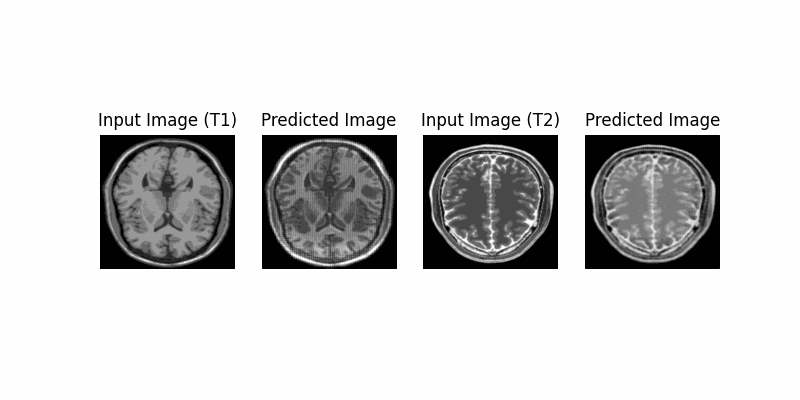

# 🧠 MRI Contrast Style Transfer using CycleGAN

### 🎓 Deep Learning Capstone Project by Gursewak Singh & Rinkal Rohara

---

## 🩺 Project Overview

Misdiagnosis in medical imaging, especially with MRI scans, is a common and critical issue. Radiologists often require multiple contrast variations (like T1 and T2 weighted scans) for accurate diagnosis. However, acquiring both T1 and T2 images is expensive and time-consuming.

This project aims to use a **CycleGAN**-based model with a **modified U-Net generator** to perform **style transfer between T1 and T2 MRI scans** — enabling the synthetic generation of one modality from another.

---

## 🛠️ Tech Stack

- 🧪 TensorFlow & Keras
- 📈 Matplotlib & Skimage
- 🧠 CycleGAN with U-Net Generator
- 💻 Jupyter Notebook

---

## 🧪 Problem Statement

> Build a generative adversarial network (CycleGAN) to translate unpaired T1-weighted MRI images to T2-weighted images (and vice versa) to improve diagnostic utility.

---

## 🔁 Project Pipeline

1. **📚 Data Understanding**
   - Unpaired dataset of T1 & T2 MRI scans
   - Conversion to grayscale, resized to 256×256

2. **🧼 Image Preprocessing**
   - Normalization
   - Batch loading with augmentation potential

3. **🧱 Model Architecture**
   - 2 Generators (T1→T2 and T2→T1)
   - 2 Discriminators
   - Losses: Adversarial, Cycle Consistency, Identity

4. **🏋️ Training**
   - Alternate training of generators and discriminators
   - Epoch-wise output visualizations

5. **🖼️ Output**
   - Side-by-side real and generated MRI scans
   - GIF showing evolution of generated images

---

## 📊 Sample Results

Here’s a GIF showing how the model learns to generate T2-weighted MRI images from T1-weighted inputs over training epochs:

---

## 🔍 Future Work

- Include SSIM/PSNR metrics for evaluation
- Integrate model checkpointing
- Expand to 3D MRI volumes
- Deploy as a clinical-assist tool

---

## 👥 Authors

- **Gursewak Singh**  
  [LinkedIn](https://www.linkedin.com/in/gursewak-singh-cosmic) • [GitHub](https://github.com/gursewak96)

- **Rinkal Rohara**

---

## 📄 License

This project is part of an academic capstone. For research and educational use only.